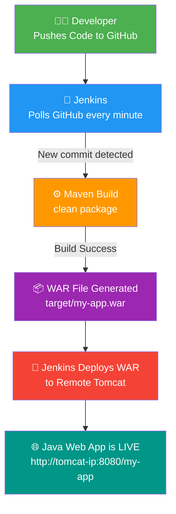

# ☕ Java Web App — Jenkins CI/CD Deployment on AWS EC2

> Deploy a Java Web App to a Remote Tomcat Server using Jenkins + Maven on AWS EC2  
> **Cloud DevOps Project — SURESHKUMAR S**

---

## 📌 What This Project Does

This project sets up a **fully automated CI/CD pipeline** where:

- You write code and push it to **GitHub**
- **Jenkins** (running on an EC2 instance) automatically detects the change
- Jenkins builds the project using **Maven** and packages it as a `.war` file
- Jenkins deploys the `.war` file to **Apache Tomcat** running on a separate EC2 instance
- Your Java web app goes **live** — no manual steps needed!

---

## 🏗️ Architecture



**Two EC2 Instances are used:**

| Instance | What Runs Here |
|---|---|
| EC2 #1 — Jenkins Server | Jenkins + Maven + Java + Git |
| EC2 #2 — Tomcat Server | Apache Tomcat + Java |

---

## 📁 Project Structure

```
jenkins-javaapp-deploy/          ← GitHub Repo Root
├── .github/workflows/
│   └── main_mywebapptest101.yml  ← GitHub Actions workflow file
├── src/main/webapp/
│   ├── WEB-INF/
│   │   └── web.xml               ← Web app configuration
│   └── index.jsp                 ← Main web page (JSP)
├── pom.xml                       ← Maven build file
└── README.md
```

🔗 GitHub Repo: [github.com/skccna1998/jenkins-javaapp-deploy](https://github.com/skccna1998/jenkins-javaapp-deploy)

---

## 🛠️ Tech Stack

| Tool | Purpose |
|---|---|
| Java 8 | Programming language |
| Maven | Build tool — compiles & packages as WAR |
| JSP | Web page technology |
| Jenkins | CI/CD automation server |
| Apache Tomcat 9 | Web server that runs the app |
| AWS EC2 (×2) | Cloud servers for Jenkins and Tomcat |
| JUnit 4.13.1 | Unit testing |

---

## ✅ Prerequisites

Before starting, make sure you have:

- [ ] Two AWS EC2 instances (Amazon Linux 2)
- [ ] Port `8080` open in Security Group on **both** instances
- [ ] Port `22` open for SSH access
- [ ] Java installed on both instances
- [ ] Maven installed on the Jenkins instance

---

## 🖥️ Part 1 — Set Up Jenkins on EC2 #1

### 1. Update the server

```bash
sudo yum update -y
```

### 2. Install Java (Jenkins needs Java to run)

```bash
sudo yum install java-17-amazon-corretto -y
java -version
```

### 3. Add the Jenkins software repository

```bash
sudo wget -O /etc/yum.repos.d/jenkins.repo \
  https://pkg.jenkins.io/redhat-stable/jenkins.repo

sudo rpm --import https://pkg.jenkins.io/redhat-stable/jenkins.io-2023.key

sudo yum upgrade
```

### 4. Install Jenkins

```bash
sudo yum install jenkins -y
```

### 5. Start Jenkins and set it to auto-start on reboot

```bash
sudo systemctl start jenkins
sudo systemctl enable jenkins
sudo systemctl status jenkins
```

### 6. Open port 8080 in AWS Security Group

1. Go to **EC2 Dashboard → Your Jenkins Instance → Security Group**
2. Click **Edit Inbound Rules → Add Rule**
3. Set: Type = `Custom TCP`, Port = `8080`, Source = `Anywhere`
4. Click **Save Rules**

### 7. Access Jenkins in your browser

```
http://<Jenkins-EC2-Public-IP>:8080
```

Get the first-time admin password:

```bash
sudo cat /var/lib/jenkins/secrets/initialAdminPassword
```

Paste it in the browser → complete the setup wizard → choose **"Install Suggested Plugins"**

---

## 🧱 Part 2 — Set Up Tomcat on EC2 #2

### 1. SSH into the Tomcat server

```bash
ssh ec2-user@<Tomcat-EC2-Public-IP>
```

### 2. Install Java

```bash
sudo su
yum update -y
yum install java-17-amazon-corretto -y
```

### 3. Download and extract Tomcat

```bash
cd /opt/
wget https://dlcdn.apache.org/tomcat/tomcat-10/v10.1.55/bin/apache-tomcat-10.1.55.tar.gz
tar -xvzf apache-tomcat-10.1.55.tar.gz
mv apache-tomcat-10.1.5 tomcat10
```

### 4. Add Jenkins user to Tomcat

This allows Jenkins to deploy the WAR file remotely.

```bash
sudo nano /opt/tomcat10/conf/tomcat-users.xml
```

Add these lines just before `</tomcat-users>`:

```xml
<role rolename="manager-script"/>
<user username="jenkins" password="jenkins123" roles="manager-script"/>
```

> ⚠️ Use `manager-script` role only — do NOT mix with `manager-gui` for the same user.

### 5. Allow remote deployment access

By default, Tomcat only allows access from localhost. We need to open it for Jenkins.

```bash
sudo nano /opt/tomcat10/webapps/manager/META-INF/context.xml
```

Find this line:
```xml
<Valve className="org.apache.catalina.valves.RemoteAddrValve"
  allow="127\.\d+\.\d+\.\d+|::1"/>
```

Replace it with:
```xml
<Valve className="org.apache.catalina.valves.RemoteAddrValve"
  allow=".*"/>
```

> ⚠️ In production, replace `.*` with your Jenkins server's private IP for security.

### 6. Start Tomcat

```bash
sudo chmod +x /opt/tomcat10/bin/*.sh
sudo /opt/tomcat10/bin/startup.sh
```

Check if Tomcat is running:
```bash
curl http://localhost:8080
```

---

## 🔧 Part 3 — Configure Jenkins Job

### 1. Install Required Plugins

Go to **Manage Jenkins → Manage Plugins → Available** and install:

| Plugin | Why |
|---|---|
| Maven Integration Plugin | To run Maven builds |
| Deploy to container Plugin | To deploy WAR to Tomcat |
| Credentials Plugin | To store Tomcat login securely |

### 2. Create a New Jenkins Job

- Click **New Item**
- Name: `JavaWebApp-Deploy`
- Type: **Freestyle project**
- Click **OK**

### 3. Connect Jenkins to GitHub

Under **Source Code Management**:
- Select **Git**
- Repository URL:
  ```
  https://github.com/skccna1998/jenkins-javaapp-deploy.git
  ```

### 4. Set Automatic Build Trigger (Poll SCM)

Under **Build Triggers**, check ✅ **Poll SCM** and enter:

```
* * * * *
```

**What this means:**

```
* * * * *
│ │ │ │ └── Day of week  (0-7)
│ │ │ └──── Month        (1-12)
│ │ └────── Day of month (1-31)
│ └──────── Hour         (0-23)
└────────── Minute       (0-59)
```

> Jenkins checks GitHub **every minute** for new commits.  
> It only starts a build if something has actually changed.

### 5. Add Maven Build Step

Under **Build → Invoke top-level Maven targets**:

```
clean package
```

This compiles your Java code and creates `target/my-app.war`.

### 6. Deploy to Tomcat (Post-Build Action)

Under **Post-build Actions → Deploy war/ear to a container**:

| Field | Value |
|---|---|
| WAR/EAR files | `**/target/*.war` |
| Context Path | `/my-app` |
| Container | Tomcat 9.x Remote |
| Tomcat URL | `http://<Tomcat-Private-IP>:8080` |
| Credentials | Add: username `jenkins`, password `jenkins123` |

> 💡 Use the **private IP** of the Tomcat EC2 instance (not the public IP) for better security.

---

## 🧪 Run & Test

1. Click **Build Now** in Jenkins
2. Watch the **Console Output** — you should see:
   ```
   [DeployPublisher][INFO] Deploying ... to container Tomcat 9.x Remote
   Finished: SUCCESS
   ```
3. Open the app in your browser:
   ```
   http://<Tomcat-Public-IP>:8080/my-app/
   ```

✅ If you see the JSP page — your pipeline is working end to end!

---

## 🐞 Troubleshooting

| Error | Most Likely Cause | Fix |
|---|---|---|
| `401 Unauthorized` | Wrong username/password | Re-check `tomcat-users.xml` |
| `403 Forbidden` | Remote IP not allowed | Update `context.xml` → `allow=".*"` |
| WAR file not found | Wrong path in Jenkins job | Use `**/target/*.war` |
| Jenkins can't connect to Tomcat | Wrong IP or port blocked | Use private IP and check Security Group |
| Build fails with Maven error | Java version mismatch | Ensure Java 17 is set in Jenkins global tools |

---

## 🔐 Security Best Practices

- Always use the **private IP** between Jenkins and Tomcat (same VPC)
- Store credentials in **Jenkins Credentials Manager** — never hardcode passwords
- Restrict Tomcat port `8080` to **Jenkins IP only** in the Security Group
- In production, set up **Nginx + HTTPS** as a reverse proxy in front of Tomcat
- Change the default `jenkins123` password to something strong in production

---

## 📦 Maven Build Info

The `pom.xml` is configured as follows:

| Config | Value |
|---|---|
| Group ID | `com.mycompany.app` |
| Artifact ID | `my-app` |
| Packaging | `war` |
| Java Source / Target | `8` |
| Output file | `target/my-app.war` |

---

## ✅ What We Accomplished

| Task | Done |
|---|---|
| Jenkins installed on EC2 | ✅ |
| Tomcat installed on a separate EC2 | ✅ |
| Jenkins polls GitHub every minute | ✅ |
| Maven builds the WAR automatically | ✅ |
| Jenkins deploys WAR to remote Tomcat | ✅ |
| App accessible via browser | ✅ |

---

## 👤 Author

**SURESHKUMAR S** 
Cloud DevOps Engineer | DevOps Enthusiast  
🔗 [github.com/skccna1998](https://github.com/skccna1998)
